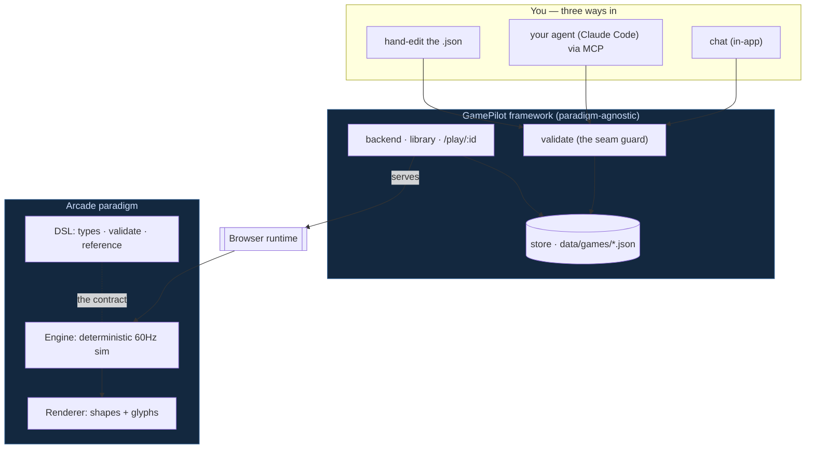

# 🎮 GamePilot

**Describe a game in a sentence. Play it in seconds. Refine it in conversation.**

GamePilot turns natural language into a playable 2D arcade prototype — no art, no assets, no engine code. You describe a game; an AI writes a small **declarative spec** (the DSL); a deterministic engine just *plays it*.

```
idea ─▶  AI / you  ─▶  GameSpec (the DSL)  ─▶  Engine  ─▶  Renderer
          emit data       ★ the contract ★      sim + rules   shapes on a canvas
```

The one rule that makes it all work: **the AI emits *data*, never code.** Its only job is `idea → GameSpec`. Everything downstream is deterministic and AI-agnostic — which is what makes the output reliable, the engine reproducible, and the games trivially shareable.

---

## Why it's interesting

- **The game *is* a JSON file.** A `GameSpec` fully defines a game — no hidden state, no code. So there are **three interchangeable ways to make one**, all validated at the same seam:
  1. **Chat** in the app — *"a tank that shoots and dodges through brick walls."*
  2. **Drive it from your own agent** (Claude Code / Desktop) over **MCP** — no API key needed; the agent you're already signed into is the intelligence.
  3. **Hand-edit the JSON** — download a game, change a number, import it back. No AI at all.
- **Gameplay over visuals.** Visuals are *semantic carriers* — primitive shapes, colors, and tiny inline pixel **glyphs** — never imported assets.
- **Refine, don't regenerate.** Design is a conversation: start minimal, then *"make enemies roam," "add a power-up," "more lives"* — each a small, validated edit, and the open tab **hot-reloads**.
- **Expressive but controlled.** The DSL is a small **core** plus composable **capabilities**, deliberately organized so it can grow without overwhelming the AI — or you. → [how that's kept in check](docs/extending-the-dsl.md)

---

## See it: a Battle City clone, built entirely in the DSL

**Tank 1990** — drive a tank that points the way it faces, fire through **destructible brick** and around **indestructible steel**, fight **three enemy tank types** (one armored — takes two hits), grab **rare power-ups** (a speed bolt; a star that lets your shots smash steel), and survive across **3 lives**.

Every bit of that is *data* — entities, rules, conditions, variables, glyphs — composed together. Across a dozen refinements (directional firing, roaming AI, solid bodies, pixel-glyph tanks, power-ups…) only two ever touched the engine as genuinely new **capabilities** (glyph rendering, solid-body collision); the rest was pure composition. **The games got richer; the schema didn't.**

…and it's not just tanks. The same contract already plays **Breakout** (bounce physics + a tilemap of bricks), a **Frogger** lane-crosser (built with *zero* new engine code), scrolling **mazes**, and **Snake** — a *growing* snake you steer Tron-style. Snake is the telling one: a trailing-body genre that started out *past* the engine's edge, brought fully in-scope by two tiny, composable additions — a `runner` control (constant-forward, steer-only) and a `ttlFrom` spawn field (a body that lengthens as you eat). New genres, almost always, are new *data* — not new engine.

---

## Architecture at a glance



Three strictly separated layers — **DSL** (the contract), a deterministic **engine**, a no-asset **renderer** — wrapped by a backend, a games library, and an MCP server. Only the DSL + engine + renderer is game-specific; the rest is a reusable frame. → [full architecture](docs/architecture.md)

---

## The DSL in 30 seconds

```jsonc
{
  "world": { "width": 800, "height": 600, "background": "#0b0b12" },
  "entities": [
    { "id": "player", "kind": "player", "shape": "circle", "color": "#4aa3ff",
      "control": "follow-pointer", "props": { "speed": 260 } },
    { "id": "food", "kind": "food", "shape": "dot", "color": "#ffd23f",
      "spawn": { "random": true, "count": 18, "maintain": 18 } }
  ],
  "rules": [
    { "on": "collision", "between": ["player", "food"],
      "effects": [ { "op": "destroy", "target": "other" }, { "op": "score", "value": 1 } ] }
  ],
  "win": { "when": "score >= 20" }
}
```

A game is `world` + `entities` + `rules` (+ optional `vars`, `win`/`lose`). Rules are `on` *event* → `effects`, optionally guarded by a `when` condition. That tiny, uniform shape — plus a handful of composable capabilities (input & projectiles, variables, spawn areas, obstacles, **glyphs + animation + hit-flash**, a **scrolling camera**, **tilemap** levels, **bounce** physics, and **runner** movement) — spans whole genres: shooters, dodgers, collectors, **tank battles**, **scrolling mazes**, **Breakout**, **Frogger-style lane-crossers**, and **Snake**. Most archetypes are pure composition — e.g. the lane-crosser added *zero* new engine code. → [full DSL reference](docs/dsl.md)

---

## Getting started

```bash
npm install
npm start        # builds the client, then serves everything on http://localhost:4321
```

| URL | What |
|---|---|
| `/` | the workspace — a game stage + a chat panel to create/adjust |
| `/games` | your library — play, **download**, and **import** games |
| `/play/:id` | play/edit a saved game (hot-reloads on external edits) |
| `/mcp` | the MCP endpoint your agent connects to |

→ [more commands & dev setup](docs/architecture.md#commands)

---

## Roadmap

| Stage | Status |
|---|---|
| 1 · Library + management backend | ✅ |
| 2 · MCP server (stdio + HTTP) | ✅ |
| 3 · Skill (teach an agent to author good games) | ⏳ next |
| 4 · Agent (idea → game, end-to-end) | ⏳ |

Scope is deliberately **real-time 2D arcade**. Turn-based / board / card games are a fundamentally different runtime and **out of scope** — by design, not by limitation. → [why](docs/extending-the-dsl.md#scope-the-hard-boundary)

---

## Docs

- **[Architecture](docs/architecture.md)** — the layers, the AI seam, the MCP server, the store, and the framework-vs-paradigm split.
- **[DSL reference](docs/dsl.md)** — the `GameSpec` contract: core + capabilities + recipes.
- **[Extending the DSL](docs/extending-the-dsl.md)** — the "constitution": how to grow the DSL without bloating it.

## License

MIT — see [LICENSE](LICENSE).
