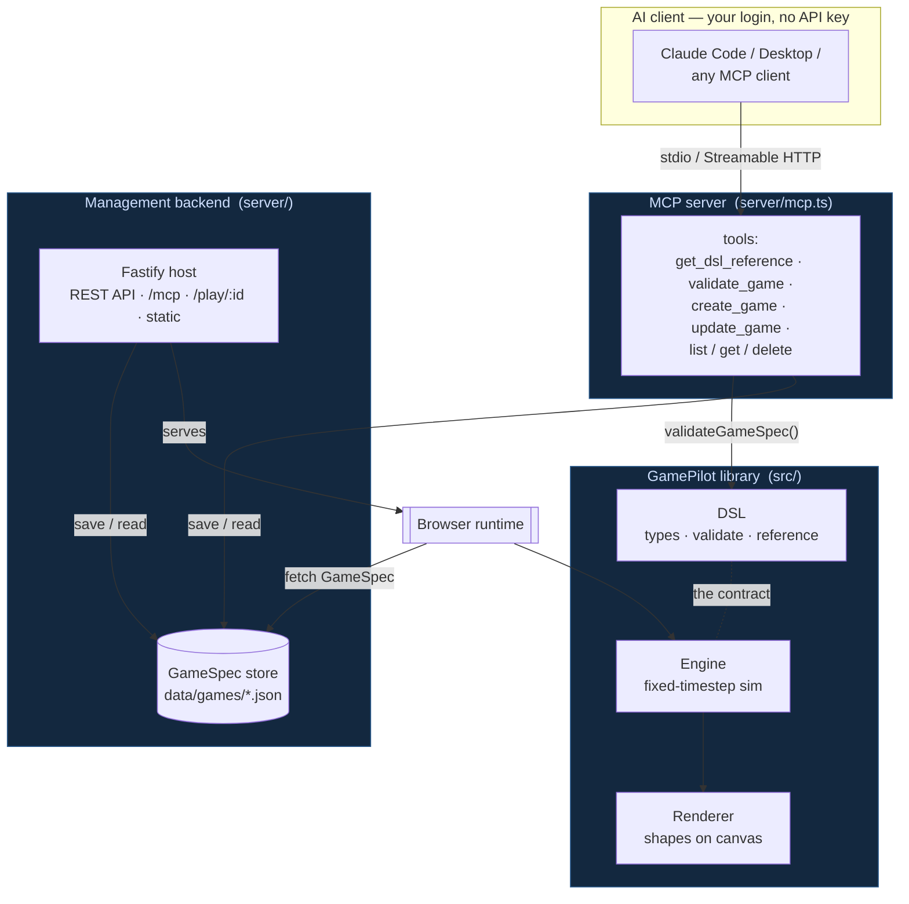
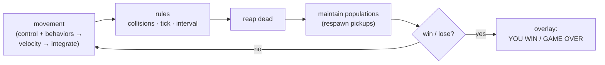
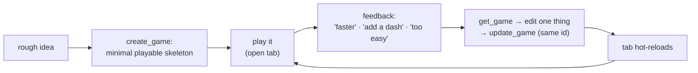
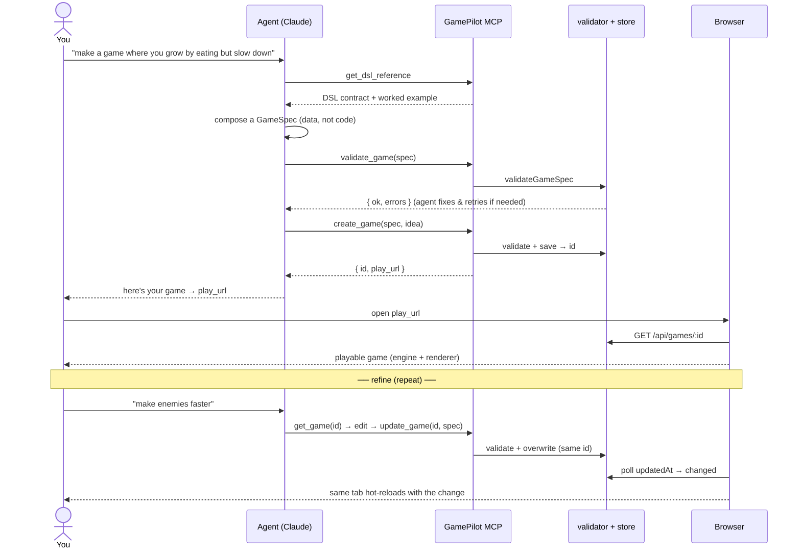
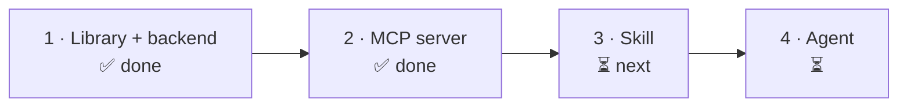

# 🎮 GamePilot

**An AI gameplay compiler.** Describe a game in a sentence; get a playable 2D prototype — no art, no assets, no engine code.

GamePilot's one idea: **the AI emits *data*, never code.** An agent turns your idea into a `GameSpec` — a small declarative JSON document — and a deterministic engine just *plays it*. Visuals are primitive shapes (circles, squares, dots); gameplay is the product.

```
idea ─▶  AI (your agent)  ─▶  GameSpec (DSL/JSON)  ─▶  Engine  ─▶  Renderer
          emits data            ★ the contract ★        sim+rules    shapes on canvas
```

Because the AI only produces data, the intelligence can come from **whatever agent you're already logged into** (Claude Code, Claude Desktop, any MCP client) — **no API key required**. GamePilot exposes itself to that agent as a set of MCP tools.

---

## Table of contents

- [What's built](#whats-built)
- [Architecture](#architecture)
- [The contract: the GameSpec DSL](#the-contract-the-gamespec-dsl)
- [How the runtime works](#how-the-runtime-works)
- [Workflows](#workflows)
- [Project layout](#project-layout)
- [Getting started](#getting-started)
- [Roadmap](#roadmap)
- [Design principles & non-goals](#design-principles--non-goals)

---

## What's built

| Layer | Status | What it is |
|---|---|---|
| **DSL** (`src/dsl/`) | ✅ | The `GameSpec` contract: types, a dependency-free validator, and the DSL reference text. |
| **Engine** (`src/engine/`) | ✅ | Deterministic fixed-timestep runtime (no DOM): movement, collisions, rules, win/lose. |
| **Renderer** (`src/render/`) | ✅ | No-asset canvas renderer (shapes + glow) and a HUD overlay. |
| **Library** (`src/index.ts`) | ✅ | One import surface for "create a game". |
| **Management backend** (`server/`) | ✅ Stage 1 | Validates, stores (`data/games/*.json`), and serves playable games. |
| **MCP server** (`server/mcp.ts`) | ✅ Stage 2 | Game authoring as MCP tools over **stdio + HTTP** — the agent-driven seam. |
| **Iterative editing** (`update_game` + live reload) | ✅ | Refine a game across a conversation; the open `/play/:id` tab hot-reloads on each change. |
| **Management UI** (chat + Pause/Replay/New) | ✅ | Two-pane workspace: conversational create/adjust (`/api/chat`) beside the playable stage. |
| **Games library** (`/games`) | ✅ | Browse every saved game as cards; open any to play/edit; delete. |
| **AI compilers** (`src/ai/`) | ✅ | `GameplayCompiler` interface + a keyword **mock** and an optional **direct-Claude** fallback. |
| **Skill** | ⏳ Stage 3 | Teaches an agent to author *good* games. |
| **Agent** | ⏳ Stage 4 | Orchestrates idea → game end-to-end. |

---

## Architecture

Three strictly separated layers (so the AI is swappable and the engine stays testable headlessly), wrapped by a backend and an MCP server:



Everything downstream of the DSL is deterministic and AI-agnostic. The DSL is the only thing every layer agrees on — get it right and "the engine just plays it."

---

## The contract: the GameSpec DSL

A game is `world` + `entities` + `rules` (+ optional `win`/`lose`). Entities are shapes with a `kind`, `color`, `size`, `spawn`, optional `behavior` and `control`. Rules are `on` *event* → `effects`.

```jsonc
{
  "meta": { "title": "Grow & Slow", "idea": "grow by eating, but slow down" },
  "world": { "width": 800, "height": 600, "background": "#0b0b12", "edges": "wall" },
  "entities": [
    { "id": "player", "kind": "player", "shape": "circle", "color": "#4aa3ff",
      "size": 14, "control": "follow-pointer", "spawn": { "x": 400, "y": 300 },
      "props": { "speed": 260 } },
    { "id": "food", "kind": "food", "shape": "dot", "color": "#ffd23f",
      "size": 5, "spawn": { "random": true, "count": 18, "maintain": 18 } },
    { "id": "enemy", "kind": "enemy", "shape": "square", "color": "#ff4d4d",
      "size": 13, "behavior": "chase:player", "spawn": { "random": true, "count": 3 },
      "props": { "speed": 90 } }
  ],
  "rules": [
    { "on": "collision", "between": ["player", "food"], "effects": [
        { "op": "add", "target": "self.size", "value": 1.5 },
        { "op": "add", "target": "self.speed", "value": -6 },
        { "op": "destroy", "target": "other" },
        { "op": "score", "value": 1 } ] },
    { "on": "collision", "between": ["player", "enemy"], "effects": [ { "op": "gameover" } ] },
    { "on": "interval", "every": 12, "effects": [ { "op": "spawn", "target": "enemy" } ] }
  ],
  "win": { "when": "score >= 20" }
}
```

- **Shapes:** `circle` · `square` · `dot`. **Control:** `follow-pointer` · `arrows`. **Behavior:** `chase:<id>` · `flee:<id>` · `wander`. **Spawn placement:** `spawn.area` = `top`/`bottom`/`left`/`right`/`edges`/`center`. **Obstacles:** `solid: true` blocks movement — one flag composes into walls, mazes, and cover.
- **Effect ops:** `add` · `set` · `mul` · `destroy` · `spawn` · `score` · `win` · `gameover`. In a collision, `self` = first id, `other` = second.
- **Conditions:** any rule can carry an optional **`when`** guard, so the same trigger branches on state — e.g. two `player↔enemy` collision rules, one `when: "player.shield <= 0"` (gameover) and one `when: "player.shield > 0"` (block the hit). Same expression grammar as win/lose, plus `self`/`other`.
- **Input & projectiles:** rules can trigger on **`input`** (a key or `pointer` press), and the `spawn` effect can fire a projectile **`from`** an entity, **`aim`**ed at the cursor / a direction / the nearest target — pair it with a short `ttl` prop so it despawns. That's enough for shooters (move with keys, click to fire toward the mouse).
- **Global variables:** declare named game-wide counters in **`vars`** (`lives`, `level`, `ammo`, …); rules read/write them by bare name, they show on the HUD, and win/lose can use them — e.g. `"vars": { "lives": 3 }` with `"lose": { "when": "lives <= 0" }`. (Per-entity state is just a `prop`.)
- **Win/lose** is a tiny safe expression: `"score >= 20"`, `"food.count == 0"`, `"player.size > 60"` — no `eval`.

`validateGameSpec` is the guard at the untrusted-AI-output seam. The full contract lives in [`src/dsl/reference.ts`](src/dsl/reference.ts) and is the single source of truth shared by the prompt, the MCP `get_dsl_reference` tool, and (soon) the skill.

---

## How the runtime works

The engine advances on a **fixed 60 Hz timestep** decoupled from rendering. Update order per tick is deliberate:



Respawn happens *after* reaping so destroyed pickups reappear. Time is seconds, distances are world-units (pixels), `speed` is units/second. The PRNG is seeded, so a given seed + idea reproduces a playthrough.

---

## Workflows

### 1. Agent-driven, iterative (the primary path — no API key)

Game design is a **conversation**, not a one-shot prompt. The agent starts a minimal playable game, then refines it turn by turn — and because the play page **hot-reloads**, you watch each change land in the same browser tab without navigating.



A single round of that loop, in detail:



### 2. In-app management UI (chat + controls)

The web app is a two-pane workspace: a **game stage** with **Pause / Replay / New** controls beside a **conversation panel**. Each chat message hits `POST /api/chat`, which turns it into a new game (or an edit of the current one) via a `GameplayCompiler` — the **direct-Claude** compiler when the backend has an `ANTHROPIC_API_KEY`, otherwise the offline **keyword mock** (limited, but handles "faster / more enemies / bigger / no enemies"). The stage reloads with the result.

```
chat message ─▶ /api/chat ─▶ compiler (Claude if key | mock) ─▶ create / adjust ─▶ store ─▶ stage reloads
```

Same iterative loop as the agent path, driven from the browser. Without model access the chat is approximate; the agent-via-MCP path is the most capable.

### 3. Hand-authored

Write a `GameSpec` by hand (see [`growAndSlow.ts`](src/dsl/samples/growAndSlow.ts)), `POST /api/games`, open the returned `/play/:id`.

---

## Project layout

```
src/
  dsl/            the contract
    types.ts          GameSpec shape  ·  validate.ts  runtime validator (the seam guard)
    reference.ts      DSL-as-prose (single source of truth for teaching the AI)
    samples/growAndSlow.ts   canonical example
  engine/         deterministic runtime (no DOM except input.ts)
    engine.ts loop · world · entity · movement · collision · rules · conditions · rng
    engine.smoke.ts   headless test of the core
  render/renderer.ts   no-asset canvas renderer + HUD
  ai/             the AI seam
    compiler.ts       GameplayCompiler interface
    mockCompiler.ts   offline keyword stand-in
    anthropicCompiler.ts  optional direct-Claude (needs a key)
    httpCompiler.ts · buildPrompt.ts
  index.ts        library barrel  ·  main.ts  browser entry
server/           management backend + MCP server
  store.ts        file-based GameSpec store (data/games/*.json)
  http.ts         Fastify: REST API · /mcp (Streamable HTTP) · /play/:id · static
  index.ts        HTTP entry  ·  mcp.ts  MCP tools  ·  mcp-stdio.ts  stdio entry
.mcp.json         registers the stdio MCP server for Claude Code
```

---

## Getting started

```bash
npm install
```

**Play the sample / develop the client** (Vite, hot reload):
```bash
npm run dev            # http://localhost:5173
```

**Run the full backend** (REST API + MCP-over-HTTP + playable host):
```bash
npm start              # builds the client, then serves on http://localhost:4321
#  →  http://localhost:4321/            the management UI (stage + chat)
#  →  http://localhost:4321/games       your games library
#  →  http://localhost:4321/play/<id>   play / edit a saved game
#  →  http://localhost:4321/mcp         MCP over Streamable HTTP
```

**Connect an agent (MCP):**
- **Claude Code** — `.mcp.json` already registers the `gamepilot` stdio server; approve it and ask your agent to make a game. (Run `npm start` too, so `play_url`s open.)
- **stdio, any client** — launch `npm run mcp` (`server/mcp-stdio.ts`); stdout is the JSON-RPC channel.
- **HTTP, any client** — point a Streamable-HTTP MCP client at `http://localhost:4321/mcp`.

**Tests:**
```bash
npm run smoke          # headless engine test (spawning, collisions, win/lose)
npm run build          # type-check (strict) + production build
```

> **Play in a browser is mouse-driven** — the player follows your cursor. (Headless screenshots show "GAME OVER" instantly because there's no pointer to move.)

---

## Roadmap



1. **Library + management backend** — engine/DSL as a library; a server that validates, stores, and hosts playable games. ✅
2. **MCP server** — author games via MCP tools (stdio + HTTP) so any agent can drive it, no API key. ✅
3. **Skill** — teach an agent to produce *good* games (design patterns + the validate→create workflow), reusing `src/dsl/reference.ts`.
4. **Agent** — an orchestration that takes an idea and returns a playable game end-to-end.

---

## Design principles & non-goals

**Principles** — gameplay over visuals; the AI emits data, never code; the DSL is the contract; the engine is deterministic and headlessly testable; validation guards every seam.

**Non-goals** — high-fidelity graphics, asset pipelines, physics realism, or competing with a production game engine. GamePilot is for turning ideas into *playable* prototypes fast.

---

## License

MIT — see [LICENSE](LICENSE).
